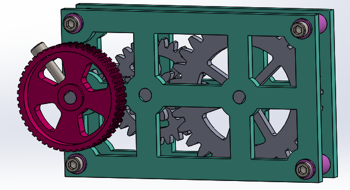

# Advanced-CAD

This is a repo of my SolidWorks assignments.

## Gearbox

### Discription

In this assignment we got instructions to make the different parts. We then had to assemble the parts using the correct mates so it moved.

### Lesson(s) Learned

* How to use gear mates
* Learned again how to use global variables and equations 

### Picture

This is a picture of the final product.

## Motion Study

### Discription

In this assignment I was given the instructions to build the different parts and then assemble them. After I assembled the parts I was taught how to make it move with different directions of gravity.

### Lessons Learned

* How to make a motion study
* You can see how much weight something can take before it breaks in solidworks

### Picture

This is a picture of the final assembly of my motion study.

